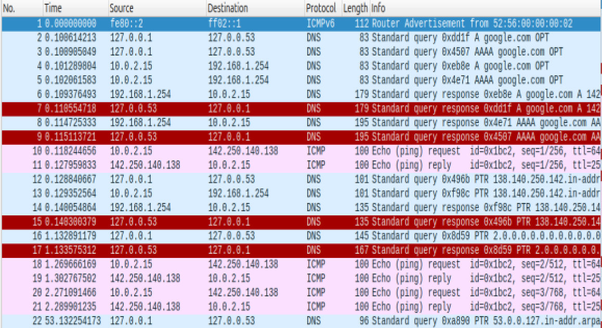
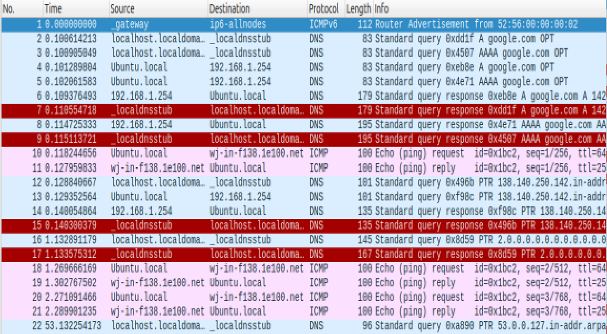
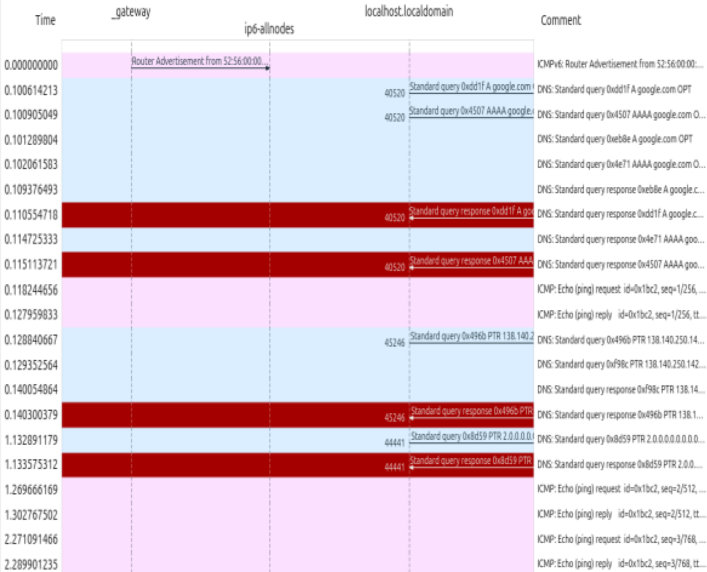
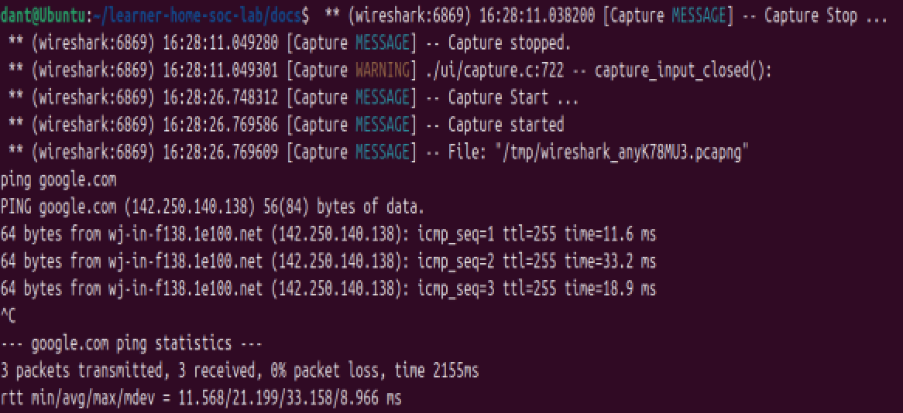
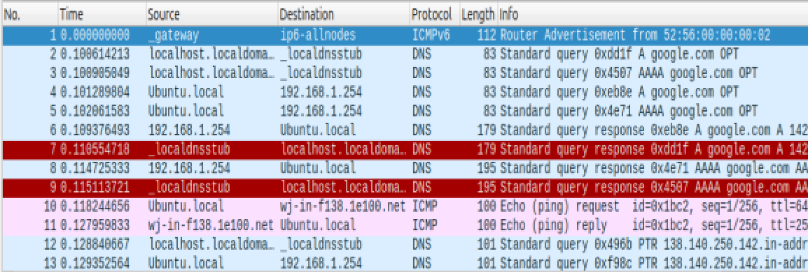
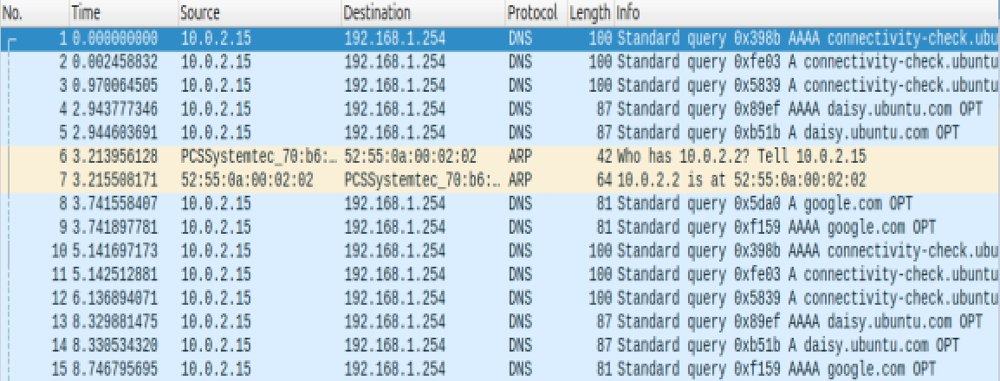
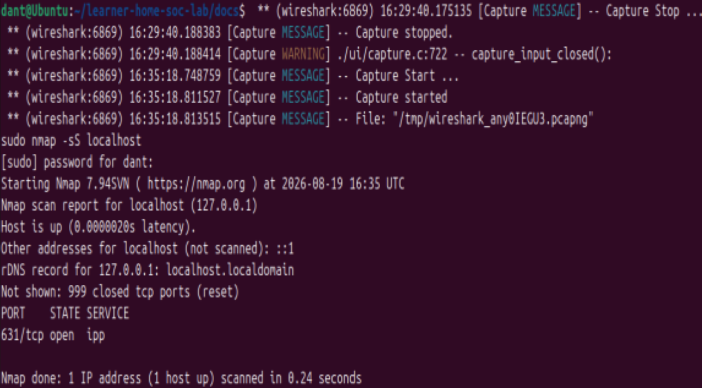
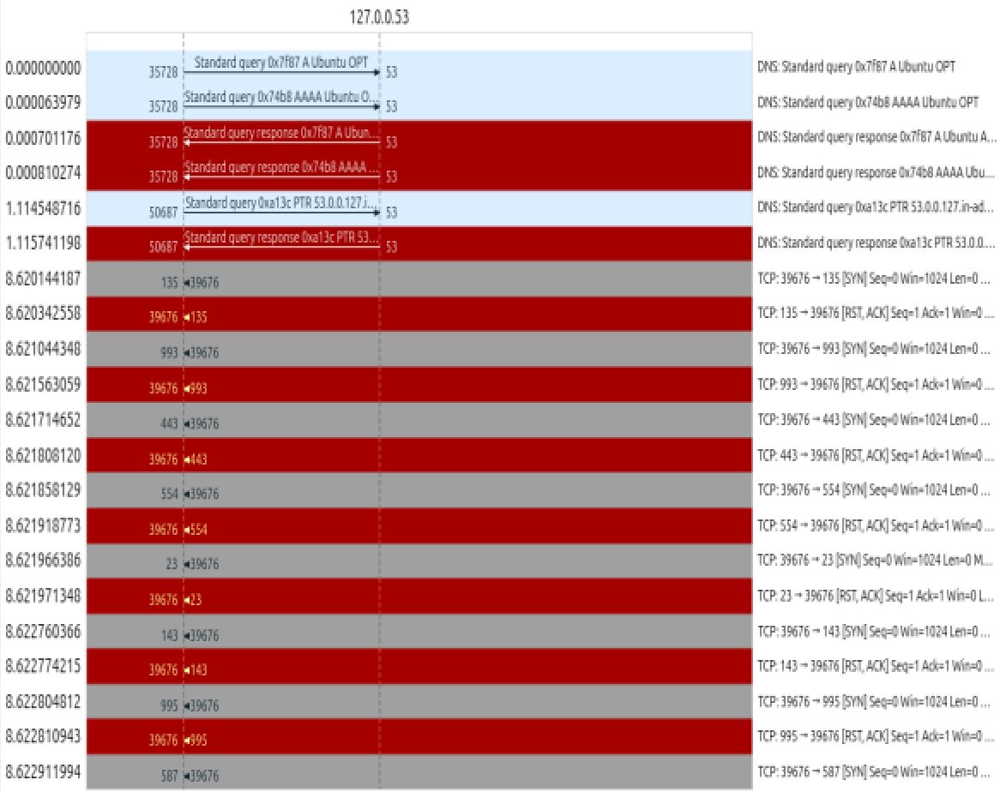
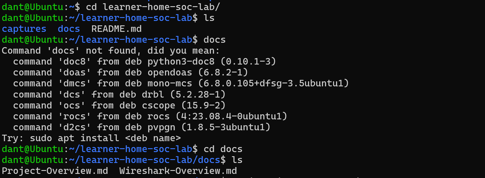
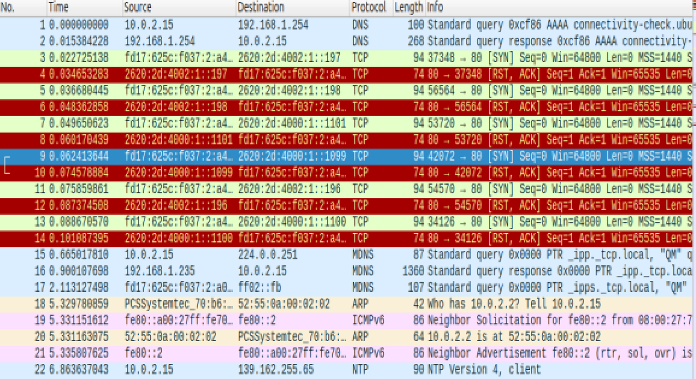

# Wireshark Overview

This document acts as my exploration and understanding of Wireshark, a network packet analyzer tool that I will be using as part of this project.

- [Why Use Wireshark?](#why-use-wireshark?)
- [Wireshark Fundamentals](#learning-wireshark-fundamentals)
    - [Notable Features](#notable-features)
        - [Name Resolution](#name-resolution)
        - [Colour Coding](#colour-coding)
        - [Flow Graph View](#flow-graph)
    - [Filtering Captures](#filtering-captures)
- [Captures & Observations](#captures-&-observations)
    - [Ping Capture](#ping-capture)
    - [Nmap Capture](#nmap-capture)
    - [SSH Login Capture](#ssh-login-captures)

## Why Use Wireshark?

Wireshark is an extremely powerful, open-source software and is free of cost. It seems to allow for very close inspection of network packets, and comes with a variety of features to help in this aspect.

It is useful for this project as it can be used to examine security problems and learn network protocols- which is vital for my understanding of networks and my eventual entry into cybersecurity (if all goes well!).

## Learning Wireshark Fundamentals

After first installing Wireshark and starting it in my VMs terminal, I was met with the starting menu, which showed various network interfaces which could be analysed. I investigated the potential of filters, which I have written down in the Filtering Captures section. I then had quick overview of the entire suit of options, writing any features of note in the Notable Features section.

I then moved to the documentation of Wireshark, officially available [here](https://www.wireshark.org/docs/wsug_html_chunked). I spent a shorter time on this, preferring to have a look at the software itself. I wrote down all of the core features I learned from the document within the notable features section.

### Notable Features

The menu page shows a list of available network interfaces the user can select from. Once chosen, the user can move onto capturing the packets sent across the network being observed. This is further investigated in the Filtering Captures section.

Smaller, notable features made the software very interesting to use, and also showed why the software is considered so powerful. Below are some of the features I found especially note worthy:

#### Name Resolution

Name Resoltion -> Resolve Network Addresses can be used to show domain names, which are much easier to interpret when observing the conversation of packets.

Below is a picture of the sources and destinations without using the name resolution feature:

Whereas with the name resolution feature (mainly the Network Addresses), the domain names are shown, making it much easier to read:

#### Colour Coding

Colour coding automatically colours packets into similar groups. This makes it much easier to search for packets that are part of the same communication.

#### Flow Graph

Flow graphs can be used to see the flow of communication between devices. Below is a picture of a flow graph of the "ping google" capture:

This feature was extremely useful for me, who only has entry-level knowledge as of now. It acted almost like a timeline of the conversation between devices, and gave a full overview of the packets location and how they were passed through networks.

### Filtering Captures

There are two types of filtering available: display and captures.

Filtering display will continue to capture all packets, but only display packets to the user that meet the criteria. This filter is set __after__ capturing packets.

Filtering captures will only capture packets that meet the criteria- and is set __before__ capturing packets. 

| Filter By: | Syntax Example | Description |
|------------|----------------|-------------|
| Protocol | 
''''

http

''''
 | Used to identify specific protocol traffic. |
| IP Address | 
''''

ip.addr == 192.168.1.1 

''''
 | Can be used to track communication with known malciious IPs.|
| Traffic Patterns | 
''''

frame.len > 1500 

''''
 | Here frame.leb can help detect high packet rates (which can signal potential security incidents). |
| Specific Ports| 
''''

tcp.port == 80

''''
 | Can be used to monitor specific ports, and help detect unauthorized services. |

## Captures & Observations

In this section I begin capturing simple network traffic, and then observing them so I can gather more knowledge on using Wireshark, and what my computers network traffic, are as a whole.

### Ping Capture

First I capture the results of a 'ping' to goggle.com, which simply sends data packets to Google's servers and waits for a reply. It doesn't actually relay any meaningful data, other than confirming the connection.

#### Process

Pinging google.com is extremely straightforward, and I showed the process in the terminal below. I sent 3 packets using ping, and received 3 in turn, which already shows that the connection to Googles servers has worked.

After reviewing the text in the terminal, which simply shows the three packets being transmitted, I observed the packets within Wireshark.

#### Capture

By using the [name resolution feature](#name-resolution), I can see the full process of fetching the domain name (with the majority of starting protocols being DNS).

After that, ICMP protocols are used to ping a request and reply from the Ubuntu local machine to (expectedly) google's servers.'

#### Observations

This process occured three times, with the DNS process taking less time for the second and third pings- perhaps because the domain may be recognised after the first ping?

What is most important is that three packets were sent, and three replies were given from Google servers, which shows that the full communciation process is working.

This test is helpful to my learning as ping can be used to ensure a working connection in a machine- and Wireshark lets this test go even further to ensure every step of the process has worked correctly.

Out of interest, I turned off my Wifi connection and tried the same test, showing the Wireshark results below:

The process doesn't get past DNS- as it can't access any addresses within the local servers (due to them being off the local network and without any connection). An ARP is sent to attempt to find the address, presumably in the local network, but since it's not present it simply continues with the next attempt.

### Nmap Capture

My next capture was via an Nmap scan. An Nmap scan sends raw IP packets across the network to find open ports, active hosts, and discover other things within the network.

#### Process

Starting an Nmap scan can simply be done in the terminal of a computer, and is easy to carry out. I only did a local host scan (for simplicity, and because I didn't want security risks being up on Github!).

The scan, as shown below, took a very short amount of time as there was only one IP address (my local VM) to scan. As such, it took only 0.24 seconds.

#### Capture

The capture was very large, but due to it being a local-only scan, the source and destination remained the same.

TCP was the only protocol used, which makes sense as the Nmap scan only requires the detection of port states as opposed to requiring actual information.

#### Observations

By using the [flow chart function](#flow-graph), I can observe, as previously mentioned, that the communication stays on the host machine (with only the IP of the VM being shown). 

Furthermore, a noticeable pattern is the presence of ports being "hopped" between (e.g. port 587 locates port 39676, which then "hops" to 256, which then "hops" again, etc).

However, after some further investigation from online sources, I discovered that this is in fact the process of Nmap showing up strangely on a flowchart, and me misreading the pattern!

What in fact happens, is Nmap chooses one source port, in this case 39676, which then sends packets to many destination ports, which then each individually reply. Very interesting!

### SSH Login Capture

Finally, I want to capture an SSH Login to my VM from my host machine. After looking into this, it was a much simpler approach than I expected. I was intimidated that my IP address would be leaked onto Github if done incorrectly, but after investigation I found I could use NAT mode, which means VirtualBox acts as a middleman for the process and as such I can have no concern storing my capture here.

Before searching for interesting network processes to capture, I didn't actually know what an SSH login was. From my knowledge now, it is effectively a remote login to a different computer's terminal. I thought this would lead to an interesting interaction on my computer.

#### Process

The process was simple: leave my virtual machine open to be logged in via SSH from my local machine, then use the Powershell on my local machine to log in, all the while capturing the process from my virtual machine. After doing this, I accessed my VM and found my project directory, as shown below:

The capture I received from this process was much more complex than the previous captures I've done, but I still had a quick scan to attempt to understand parts of the process!

#### Capture

The capture only observed the successful connection and the subsequent actions taken from the VirtualBox "middleman" that was used, rather than any of the processes taken on my local machines side.

As such, after VirtualBox successfully connected to the VM, all further actions were indirectly done from my local machine, but via the flowchart they all appeared to come from the VirtualBox middleman:

#### Observations

I first investigated the TCP handshake, where the two devices establish a connection. I can observe this having occured where SYN and SYN,ACK were present. By using a filter, I can find where syncronisation is occuring using the sync flag:

By observing the flowchart after this initial handshake, I found that all further interaction was one sided, as expected, with the VirtualBox middleman sending the actions to the VM. However, I stopped investigating with the flowchart after finding out that the flowchart isn't often utilised by network analysts for anything other than a quick, rough overview- rather than the level of dependence I was using it on!

My time observing these network conversations has been really interesting, especially finding out more about how one can analyse networks.

